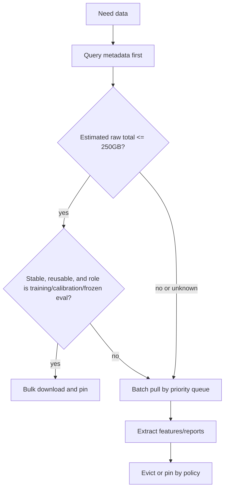

# Astrometrics Data Selection Policy

Date: 2026-07-05

Purpose: This file tells coding agents how to choose **training data** and **live search data** for the three Astrometrics projects:

- `2026 Technosignatures`
- `2026 Exoplanet Research`
- `2026 Near Earth Objects`

This file is intentionally separate from the implementation guide because data selection is a scientific decision layer, not just an engineering decision.

## What The Agent Should Do With This File

1. Copy this file into each repo as `docs/ASTROMETRICS_DATA_SELECTION_POLICY.md`.
2. Read this file before downloading data, changing training sets, choosing live search targets, or creating candidate queues.
3. Use this file to decide whether a dataset belongs in training, validation, calibration, frozen eval, live search, or follow-up live search.
4. Record all data-selection decisions in `data_selection/data_selection_decision_log.md`.
5. Do not use live search data for model training unless it is explicitly demoted into a future training manifest and excluded from future blind-search claims.
6. Preserve citations inline and in the bibliography. Do not move citations to a separate file.

## Core Principle

Training data and live search data serve different purposes and must be chosen by different rules.

Training data hardens the model stack. Live search data maximizes the chance of making material contributions to the scientific community.

Do not mix these criteria.

| Data type | Main purpose | Selection logic | Success metric |
|---|---|---|---|
| Training data | Make models robust, calibrated, and honest about uncertainty | Diversity, labels, failure modes, distribution coverage, hard negatives | Better grouped holdout, calibration, injection recovery, artifact rejection |
| Live search data | Find candidates worth publishing, following up, or contributing to catalogs | Scientific value, novelty, observability, target priority, follow-up leverage | New candidates, validated null results, recoveries, follow-up-ready reports |

## Current Reality Override — 2026-07-11 — Read This First

### Technosignatures labeled-data override

For `2026 Technosignatures`, labeled datasets are admissible only when their
row-level labels already exist, were independently supplied, and have documented
provenance. Never ask the user or anyone else to create labels, never construct
an annotation/review set, and never infer ground truth from unlabeled live or
archival observations. There are no positive technosignature labels. Missing
label evidence leaves the affected calibration or promotion gate fail-closed.
This override controls any generic training/calibration language below.

**There is no 4TB external SSD for this project, and no cloud storage available for testing.** The user stated this explicitly: "we can't use more that 100G of local store ever. We can't use external storage to test. Work within these constraints." Every section below that assumes a 4TB workspace, a 500GB reserve, or an optional cloud tier does not apply to `2026 Technosignatures` right now. Treat every number in this file as **downscaled to a single, permanent, hard 100GB local cap** for this project's entire data footprint (`data/` + `models/` + `artifacts/`), enforced in `scripts/download_bl_extended_corpus.sh` via `TECHNO_LOCAL_STORAGE_CAP_GB` (default 100). As of 2026-07-11 the real footprint is ~9GB, leaving ~91GB of real headroom.

Concretely, under this override:
- The "conservative 100GB active-cache" fallback described throughout this file is not a fallback — it is the only mode.
- Batch caps below (250GB/200GB/100GB/50GB/25GB) are **not usable at their stated size**; any real batch must fit inside remaining headroom under the 100GB total, not under the 4TB/500GB-reserve numbers.
- The `raw_download_approval_required` queue can and will grow far past 100GB in size-preflight terms (it is a priority-ranked wishlist, not a download plan) — that is fine. What must never happen is actually holding more than 100GB of raw/derived data locally at once.
- The only way to search a queue larger than the cap allows is `stream_process_evict`: pull a small bounded batch, run turboSETI/pipeline immediately, save the compact derived candidate reports/features (small), then delete the raw HDF5 payloads before pulling the next batch. This is not a nice-to-have here — it is mandatory.
- If a future session has real access to an external SSD or approved cloud storage, that changes this override; until then, do not plan around the 4TB numbers below.

## 4TB External SSD Local Workspace (not applicable right now — see override above)

The expected local setup is a **4TB external SSD** used as the primary Astrometrics workspace for all three projects. The old 100GB number is no longer a hard per-project limit. It remains a conservative default **active raw batch/cache guardrail** for agents that do not know the current drive budget.

Agents must treat the 4TB drive as a working cache and project workspace, not as a mandate to hoard public raw archives.

Default local storage rule:

```text
Keep project state locally.
Keep selected active raw batches locally.
Do not permanently store broad public archive raw data.
Re-download public raw data by URI/query when needed.
Pin only frozen eval, calibration, candidate evidence, expensive-to-reconstruct data, or user-approved offline working sets.
```

Evidence basis:
- TESS-SPOC warns that fully downloading target pixel, light curve, and validation files for a single TESS sector is approximately **650GB for Sectors 1-26** and approximately **1.8TB for extended mission sectors**, and recommends downloading target-list CSV files first to cross-match before querying and downloading data products (MAST, "TESS-SPOC").
- Breakthrough Listen states that archive files can be several GB and should be searched by telescope, file type, data type, quality, cadence, target role, and sky position before download (Breakthrough Listen, "Open Data Archive"). Its public-data release paper also describes extremely large data rates and archive scale (Lebofsky et al.).
- MAST/astroquery provides metadata and product-list APIs before download, including `get_product_list`, product filtering, `mrp_only`, file extension filters, and curl-manifest generation (Astroquery Collaboration, "Observation Queries"; Astroquery Collaboration, "astroquery.mast.observations").
- Industry cost-optimization guidance says to inventory data, identify access patterns, optimize data lifecycle, segment data by usage, minimize transfer, compress/deduplicate where useful, and delete unneeded data (Microsoft, "Architecture Strategies for Optimizing Data Costs"). These are directly applicable to a laptop-plus-external-SSD scientific workflow.

Default 4TB workspace budget:

| Storage class | Default cap | Purpose | Eviction rule |
|---|---:|---|---|
| Metadata, manifests, catalogs, target queues | 100GB | Query planning, provenance, reproducibility | Never evict unless regenerated and checksummed |
| Frozen eval and calibration sets | 300GB | Comparable model reports and thresholds | Never evict without user approval |
| Active raw batch caches across all projects | 1200GB | Current training/search/follow-up batches | Evict after feature extraction and candidate report generation |
| Derived features and embeddings | 900GB | Reusable model inputs, ANN indexes, summary arrays | Keep newest useful version; evict obsolete versions |
| Candidate evidence packages and reports | 400GB | Human review, publication/follow-up handoff | Pin accepted/high-priority candidates |
| Models, checkpoints, and benchmark artifacts | 300GB | Reproducible model comparisons | Keep benchmark/released/best; evict scratch checkpoints |
| Reserve | 500GB | Safety margin for downloads, temp files, failed runs | Must stay free before starting a large batch |

Agents may move space between classes, but must preserve the 500GB reserve and record large deviations in `data_selection/data_selection_decision_log.md`.

If the agent cannot confirm that the 4TB external SSD is mounted, fall back to the conservative 100GB active-cache behavior.

## Acquisition Mode Decision Tree

Agents must choose an acquisition mode before downloading raw data.



Default rule:

```text
Download all metadata first.
If estimated total raw size is unknown or above 250GB, batch pull.
If estimated total raw size is above 500GB, bulk download is forbidden unless the user approves it.
If one file is above 25GB, log why that specific file is necessary before downloading it.
If free space after download would fall below 500GB on the 4TB workspace, abort or shrink the batch.
If the external SSD is not mounted, use the conservative 100GB active-cache rule.
```

Acquisition modes:

| Mode | Use when | Do not use when | Required evidence |
|---|---|---|---|
| Metadata-only | Planning target queues, estimating size, deduping, crossmatching | Never skip this step | Archive query, target list, catalog table, product list |
| Bulk download | Total raw size is <=250GB, data is stable, reusable, and likely to be used repeatedly | Data is broad public raw archive, sector/archive-scale, or uncertain size | Manifest, checksums, expected total size, role |
| Batch pull | Data is larger than 250GB, live-search oriented, target-specific, or frequently changing | Dataset is tiny and stable | Batch manifest, target queue snapshot, size estimate |
| Stream/process/evict | Raw products are re-downloadable and derived features are enough for most modeling | Candidate evidence requires raw context | Feature manifest, re-download URI, checksum if available |
| Candidate evidence package | A candidate is high priority, publishable, or needs follow-up | Low-priority negatives or routine controls | Raw links, cutouts/light curves/spectra, metadata, plots, report |

Concrete archive rules:

| Project | Metadata-first source | Raw download rule |
|---|---|---|
| Exoplanets | NASA Exoplanet Archive TAP tables, TOI tables, MAST target lists, MAST product lists | Do not bulk-download TESS sectors by default. Pull light curves or target-pixel files by TIC/target batch. Prefer light curves first; pull target-pixel files only for centroid/background checks or high-value candidates. |
| Technosignatures | Breakthrough Listen archive filters, target metadata, cadence metadata, hit tables | Do not bulk-download baseband or wide raw archives. Pull HDF5/filterbank products or smaller derived products by target, cadence, file type, and frequency range. |
| Near Earth Objects | MPC NEOCP, JPL Scout, known-object lists, survey metadata, image product manifests | Do not bulk-download whole survey image collections unless curated and justified. Pull image cutouts/chips or time windows around target tracks when possible. |

## Batch Specification

Every batch must be planned before retrieval.

Create one batch manifest per acquisition:

```yaml
batch_id:
project:
role: training | validation | calibration | frozen_eval | live_search | followup_live_search
acquisition_mode: bulk | batch | stream_process_evict | candidate_evidence_package
target_queue_snapshot:
source_archive:
query:
estimated_download_gb:
max_allowed_download_gb:
expected_raw_files:
expected_derived_gb:
free_space_before_gb:
free_space_required_after_gb: 500
eviction_rule:
pin_rule:
stop_condition:
manifest_owner:
created_at:
```

Default batch caps:

| Batch type | Max raw download per batch | Reason |
|---|---:|---|
| Training expansion | 250GB | Enough for diversity without swallowing the 4TB workspace |
| Live search | 200GB | Keeps room for candidate reports, reruns, and other projects |
| Follow-up urgent batch | 100GB | Keeps response fast and targeted |
| Frozen eval/calibration addition | 50GB per addition | Frozen sets should grow intentionally |
| Candidate evidence package | 25GB per candidate unless approved | Review packets should be compact and portable |

Stop a batch immediately if:

1. The actual downloaded size reaches the batch cap.
2. Local free space would fall below 500GB on the 4TB workspace, or below 10GB in conservative 100GB-cache mode.
3. Product metadata does not match the manifest.
4. The archive query returns a materially different target/data population than expected.
5. The batch begins producing duplicate or already-reviewed targets without a logged reason.

## Cache And Eviction Policy

Pin these:

1. Dataset manifests, batch manifests, target queues, and decision logs.
2. Frozen eval and calibration data.
3. Candidate evidence packages for accepted, unresolved, publishable, or follow-up candidates.
4. Small derived features, embeddings, and indexes that are expensive to regenerate.
5. Raw data for candidates that cannot be reliably reconstructed from archive URIs.

Evict these first:

1. Raw products already converted into checksummed features and candidate plots.
2. Duplicate products with identical archive URI/checksum.
3. Failed batch products that did not enter any manifest.
4. Superseded embeddings or features after downstream reports are regenerated.
5. Low-priority controls once their eval summary and manifest are preserved.

Agents must prefer columnar, compressed, queryable derived formats such as parquet, feather, zarr, or HDF5 for reusable features when the repo already supports them. This follows the general best practice of optimizing file formats and data volume for access patterns (Microsoft, "Architecture Strategies for Optimizing Data Costs").

## Required Data Roles

Every dataset must have exactly one current role.

| Role | Can train on it? | Can tune thresholds on it? | Can report discoveries from it? |
|---|---|---|---|
| Training | yes | no | no |
| Validation | indirect model selection only | no | no |
| Calibration | no | yes | no |
| Frozen eval | no | no | no |
| Live search | no | no | yes |
| Follow-up live search | no | no | yes |

If a live search dataset is later used for training, create a new manifest version with role `training` and mark it as no longer eligible for blind-search claims.

## Training Data Rules

Training data should not be chosen because it is exciting. It should be chosen because it improves the pipeline's ability to avoid fooling itself.

Agent rules:

1. Prioritize labeled and reviewable data over merely large data.
2. Include boring negatives, common artifacts, edge cases, and historical failures.
3. Preserve source diversity across instruments, cadences, sky regions, and pipelines.
4. Include synthetic injections only with explicit synthetic provenance.
5. Maintain separate real-only and synthetic-inclusive evaluation sets.
6. Treat unlabeled data as unlabeled, not negative. Positive-unlabeled anomaly detection exists because unlabeled pools can be contaminated with real positives or anomalies (Takahashi et al.).
7. Use grouped splits that test transfer across mission, target, sector, cadence, or survey.
8. Record all training data in manifests.
9. Record all label sources and label confidence.
10. Keep a frozen canonical eval set that agents are not allowed to optimize directly.

## Training Data Selection Score

When deciding whether to add a training dataset, score it from 0-3 on each criterion.

| Criterion | What to reward |
|---|---|
| Label quality | confirmed labels, expert review, catalog provenance, clear false-positive class |
| Distribution coverage | new instrument, sector, cadence, sky region, frequency band, object class |
| Failure-mode value | artifacts, RFI, false positives, systematics, edge cases |
| Calibration value | useful for score thresholds, uncertainty checks, top-k review calibration |
| Injection compatibility | supports realistic injections into real backgrounds |
| Reproducibility | stable source, documented API, checksums, clear license |
| Leakage safety | can be split by target/time/source without contamination |
| Cost practicality | feasible storage, compute, and download process |

Training data priority:

```text
training_priority =
  label_quality
  + distribution_coverage
  + failure_mode_value
  + calibration_value
  + injection_compatibility
  + reproducibility
  + leakage_safety
  + cost_practicality
```

Default rule:

| Score | Action |
|---:|---|
| 18+ | Add or prioritize. |
| 14-17 | Queue for targeted use. |
| Below 14 | Do not add unless the user approves a specific reason. |

## Live Search Data Rules

Live search data should be chosen to maximize material scientific contribution, not merely model confidence.

Agent rules:

1. Balance new target searches with follow-on searches.
2. Prefer targets where a positive, negative, or null result would be scientifically useful.
3. Prefer targets where follow-up is feasible.
4. Prefer data products with clean provenance and enough context for publication-quality reporting.
5. Avoid repeatedly searching easy, over-mined data unless the method is materially better.
6. Keep high-priority null results as valid outputs when they constrain parameter space.
7. Always separate live search candidates from training and calibration data.

Breakthrough Listen work demonstrates that large-scale null results can still be scientifically meaningful when they constrain transmitter rates or searched parameter space (Painter et al.; Pardo et al.). TESS survey-scale work similarly shows that live searches can be valuable when they expand coverage to fainter stars or uniformly vetted target populations (Roth et al.; Lafarga et al.).

## Live Search Data Selection Score

Score live search targets or datasets from 0-3 on each criterion.

| Criterion | What to reward |
|---|---|
| Scientific novelty | undersearched targets, new parameter space, new cadence/frequency/magnitude regime |
| Prior significance | known high-interest object, TOI/KOI/NEO risk, nearby star, unusual system |
| Follow-up leverage | observable again, cross-instrument confirmation possible, community interest |
| Data quality | sufficient SNR/depth/cadence/metadata for credible candidate reports |
| Method advantage | your pipeline can add something previous searches likely missed |
| Publication value | result would support a note, catalog contribution, null constraint, or follow-up request |
| Community integration | compatible with MPC, ExoFOP, MAST, BL archive, NASA Exoplanet Archive, or other community systems |
| New/follow-up balance | supports either a new target campaign or a planned follow-up slot |

Live search priority:

```text
live_search_priority =
  scientific_novelty
  + prior_significance
  + followup_leverage
  + data_quality
  + method_advantage
  + publication_value
  + community_integration
  + new_followup_balance
```

Default rule:

| Score | Action |
|---:|---|
| 18+ | Search or prioritize. |
| 14-17 | Search only if it fills a portfolio gap. |
| Below 14 | Avoid unless needed for controls or method validation. |

## New Search vs Follow-Up Search Balance

Default live search portfolio:

| Search category | Target share | Purpose |
|---|---:|---|
| New targets / new data regions | 60% | maximize discovery and novelty |
| Follow-on / reanalysis targets | 30% | confirm, refine, or challenge prior candidates |
| Controls / calibration live runs | 10% | keep the live pipeline honest |

Agents may adjust this only with an explicit decision log entry.

Adjustment rules:

| Situation | Adjustment |
|---|---|
| There are unresolved high-value candidates | Increase follow-on to 50%. |
| Candidate queue is stale or already reviewed | Increase new search to 75%. |
| Major pipeline changes just landed | Increase controls to 20%. |

## Target Queue Construction

Agents must build a target queue from metadata before downloading raw science data.

Required order:

1. Query catalog/archive metadata.
2. Estimate product sizes and product types.
3. Remove targets already used in training/calibration/frozen eval unless the role is explicitly follow-up.
4. Score targets using the project-specific formula below.
5. Select a batch that fits the batch cap and preserves the 60/30/10 live portfolio unless overridden.
6. Download only the products needed for the selected batch.
7. Update the queue after each batch with `searched`, `candidate_found`, `null_result`, `needs_followup`, or `rejected`.

`target_priority_queue.csv` must be created before raw live-search downloads. It should be a stable artifact that agents can inspect, sort, and diff.

Minimum fields:

```text
target_id,project,source,catalog_ids,ra_deg,dec_deg,data_products_available,estimated_download_gb,search_category,scientific_novelty,prior_significance,followup_leverage,data_quality,method_advantage,publication_value,community_integration,new_followup_balance,storage_cost_penalty,total_priority,status,notes,citations
```

General scoring:

```text
total_priority =
  scientific_novelty
  + prior_significance
  + followup_leverage
  + data_quality
  + method_advantage
  + publication_value
  + community_integration
  + new_followup_balance
  - storage_cost_penalty
```

Storage penalty:

| Estimated raw download | `storage_cost_penalty` |
|---:|---:|
| <=5GB | 0 |
| >5GB and <=25GB | 1 |
| >25GB and <=100GB | 2 |
| >100GB and <=250GB | 3 |
| >250GB | 5 and requires user approval |

Do not let model score alone choose live targets. Model score is a **candidate-ranking signal after data is searched**, not a reason to preload arbitrary raw archives.

## Download-All vs Batch-Pull Rules

Use this table when an agent is deciding whether to download all available data first.

| Data class | Default mode | Why |
|---|---|---|
| Catalog metadata, product manifests, target lists, TAP query results | Bulk metadata download | Small, reusable, and required for planning |
| Archive product lists with file sizes and URIs | Bulk metadata download | Lets agents estimate cost before raw downloads |
| Small curated training/frozen-eval datasets <=250GB | Bulk download and pin | Stable reuse justifies local storage |
| TESS-SPOC sector-level raw products | Batch pull | A single sector is large enough that it can consume too much of the 4TB workspace and should not be pulled wholesale by default (MAST, "TESS-SPOC") |
| TESS light curves for selected TICs | Batch pull | Targeted, reproducible, and compatible with MAST product filters (Astroquery Collaboration, "Observation Queries") |
| TESS target-pixel files | Batch pull only when needed | Larger than light curves; mainly needed for centroid/background or image-level evidence |
| Breakthrough Listen baseband/wide raw products | Avoid unless specifically approved | File/archive scale is incompatible with routine laptop/external-SSD work (Breakthrough Listen, "Open Data Archive"; Lebofsky et al.) |
| Breakthrough Listen HDF5/filterbank products for selected targets/cadences | Batch pull | Keeps search tied to target/cadence hypotheses |
| MPC/JPL candidate metadata and ephemerides | Bulk metadata download | Small and time-sensitive |
| Survey image cutouts or chips around NEO candidates | Batch pull | Preserves WCS/timing context without hoarding whole survey collections |
| Candidate evidence packages | Pin compact package | Needed for review, follow-up, and publication |

Practical rule:

```text
Download all metadata first.
Download all raw data only when total estimated raw size <=250GB and the dataset is reusable.
Otherwise pull raw data in priority-ranked batches.
```

## Data Contamination Rules

Agents must prevent role leakage.

Forbidden:

1. Training on live search data and later claiming blind discovery on that same data.
2. Tuning thresholds on frozen eval data.
3. Promoting a live candidate using a threshold selected on that live batch.
4. Treating unreviewed live candidates as negatives.
5. Mixing synthetic and real examples without provenance.
6. Merging candidate and training ledgers without role metadata.

Required:

1. Every dataset has a manifest.
2. Every dataset has a current role.
3. Every split has group keys.
4. Every model report states which data roles were used.
5. Every live candidate report states whether the data was new search, follow-up search, or control live run.

## Technosignatures Data Selection

### Training Data

Prioritize:

- real BL/SETI hit tables with known RFI or review labels
- MeerKAT BLUSE hit rows already used by `semisupervised_anomaly_score`
- BL GBT/Parkes/Murriyang examples with cadence metadata
- known RFI families and common false positives
- injected drifting narrowband signals in real backgrounds
- off-target/on-target cadence failures

Why:
- Technosignature work is dominated by rare positives, RFI, and candidate ranking under uncertainty. Anomaly-detection Breakthrough Listen work ranks candidates by unusualness and persistence, but reports no surviving candidates after large-scale review, reinforcing the need for RFI-aware calibration and human vetting (Pardo et al.).

### Live Search Data

Prioritize:

- nearby stars with exoplanets or high astrobiological interest
- TESS/Kepler targets with relevant exoplanet geometry
- undersearched frequency bands or cadence patterns
- targets with previous interesting but unconfirmed BL-like events
- high-value null-result target classes
- datasets where the pipeline searches a parameter space previous work did not cover

Build the technosignatures live target queue in this order:

1. Query Breakthrough Listen metadata first: telescope, file type, data type, quality flags, cadence, on-target/off-target role, target name, coordinates, and frequency coverage. The BL Open Data Archive exposes these filters and warns that technical file formats require specialized processing (Breakthrough Listen, "Open Data Archive").
2. Join targets against exoplanet-host and nearby-star metadata from NASA Exoplanet Archive where relevant. The archive provides TAP-accessible tables for confirmed planets, TOIs, and machine-learning tables (NASA Exoplanet Archive, "Retrieving Exoplanet Archive Data with TAP").
3. Split the queue into `new_parameter_space`, `followup_target`, and `control_live_run`.
4. Prefer high-quality cadence-complete observations before high-volume raw products.
5. Penalize baseband or oversized raw products unless there is a specific follow-up reason.

Technosignature live priority:

```text
technosignature_live_priority =
  scientific_novelty
  + prior_significance
  + followup_leverage
  + data_quality
  + method_advantage
  + publication_value
  + community_integration
  + cadence_completeness
  + frequency_gap_value
  - storage_cost_penalty
  - rfi_density_penalty
```

Score additions:

| Field | 0 | 1 | 2 | 3 |
|---|---|---|---|---|
| `cadence_completeness` | no off-target context | partial cadence | on/off cadence present | complete cadence with reviewable context |
| `frequency_gap_value` | heavily searched band | modest extension | undersearched band/cadence | materially new parameter space |
| `rfi_density_penalty` | clean enough | mild RFI | heavy RFI but useful as control | unusable unless training artifact set |

First live-search target classes:

| Rank | Target class | Use case | Acquisition mode |
|---:|---|---|---|
| 1 | Nearby exoplanet-host stars with BL cadence-complete observations | Publishable target-specific nulls or candidates | Batch HDF5/filterbank by target |
| 2 | Previous interesting but unconfirmed BL-like targets | Follow-up/reanalysis | Candidate evidence package plus targeted batch |
| 3 | Undersearched frequency/cadence slices with good quality metadata | Frontier anomaly search | Batch by frequency/cadence |
| 4 | Known RFI-heavy sessions | Control live runs and failure-mode calibration | Small batch, evict raw after summary |
| 5 | Very large baseband products | Only if needed for a top candidate | User-approved exception |

Default live portfolio:

| Category | Share |
|---|---:|
| New targets or new parameter-space searches | 60% |
| Follow-on of high-interest exoplanet/SETI targets or previous anomalies | 30% |
| Controls, including known RFI-heavy sessions | 10% |

Do not:

- train on a target/session and later claim a blind live search on the same target/session
- score a signal as interesting without nearest RFI-neighbor context
- report a high anomaly score without calibration context

## Exoplanet Data Selection

### Training Data

Prioritize:

- confirmed planets from Kepler/TESS
- certified false positives and eclipsing binaries
- stellar variability classes
- Kepler-to-TESS transfer sets
- TESS sector diversity
- injected transits in real light curves
- single-transit and long-period examples
- centroid/background examples where available

Why:
- RAVEN and T16 show the scientific value of large, uniform TESS searches with explicit vetting and validation, but training data must separately include false positives, simulations, and cross-sector diversity to avoid brittle candidate lists (Lafarga et al.; Roth et al.).
- Individual anomalous-transit searches should not rely only on phase-folded curves, because phase folding can hide per-transit variation (Zuckerman et al.).

### Live Search Data

Prioritize:

- undersearched TESS FFIs or faint-star samples
- high-priority TOIs/KOIs needing independent vetting
- systems with habitable-zone potential
- nearby bright stars where follow-up is feasible
- multi-planet systems where additional planets are plausible
- single-transit events needing recovery or period constraints
- anomalous transit systems where per-transit behavior matters

Build the exoplanet live target queue in this order:

1. Query NASA Exoplanet Archive tables first, especially confirmed planets, TOIs, and related candidate/status tables. TAP is the correct programmatic interface for archive-scale metadata retrieval (NASA Exoplanet Archive, "Retrieving Exoplanet Archive Data with TAP").
2. Query MAST metadata and product lists for candidate TICs before downloading files. `get_product_list` exposes available products, and `download_products` can filter products by options such as `mrp_only` and file extension (Astroquery Collaboration, "Observation Queries"; Astroquery Collaboration, "astroquery.mast.observations").
3. Download TESS-SPOC target-list CSV files before large target searches and cross-match locally, because MAST recommends this for large target lists and because full-sector product pulls are too large to use casually even with a 4TB external SSD (MAST, "TESS-SPOC").
4. Split targets into `new_target_search`, `followup_search`, and `control_live_run`.
5. Prefer light curves first. Pull target-pixel files only for high-value candidates, centroid/background checks, or image-level model experiments.

How the Exoplanet Detector knows which stars to look at first:

| Rank | Star/target class | Why it goes first | Raw data to pull |
|---:|---|---|---|
| 1 | High-priority TOIs/KOIs and single-transit candidates with available TESS/Kepler products | Follow-up leverage is high and results can integrate with community vetting. TOI releases are explicitly built for follow-up coordination (MIT Kavli Institute, "TOI Releases"). | Light curves first; target-pixel files only if needed |
| 2 | Nearby bright stars, known planet hosts, and multi-planet systems with additional-planet plausibility | Follow-up is feasible and a new detection or null can be scientifically useful | Light curves, then centroid products for candidates |
| 3 | Uniform TESS FFI samples with good Gaia/TIC metadata and enough sector coverage | RAVEN and T16 show value in large uniform TESS searches, including fainter stars and FFI-derived light curves (Lafarga et al.; Roth et al.) | Batch light curves by TIC/sector |
| 4 | Underserved faint-star or long-period/single-transit pools | Expands parameter space beyond easy bright/short-period cases | Small batches with strict injection-recovery reporting |
| 5 | Known false positives, eclipsing binaries, quiet stars, and confirmed planets | Controls, benchmark recovery, and failure-mode checks | Small pinned control batch |

Exoplanet live priority:

```text
exoplanet_live_priority =
  scientific_novelty
  + prior_significance
  + followup_leverage
  + data_quality
  + method_advantage
  + publication_value
  + community_integration
  + sector_coverage
  + stellar_metadata_quality
  + observability
  - storage_cost_penalty
  - prior_search_saturation
```

Score additions:

| Field | 0 | 1 | 2 | 3 |
|---|---|---|---|---|
| `sector_coverage` | too little coverage | one useful sector | multiple useful sectors | multi-sector coverage supporting period recovery |
| `stellar_metadata_quality` | poor IDs/metadata | basic TIC only | TIC plus Gaia/stellar parameters | strong metadata and contamination context |
| `observability` | not practical to follow up | difficult | feasible | high-quality follow-up feasible |
| `prior_search_saturation` | fresh space | modestly searched | heavily searched | over-mined unless method is materially different |

Under the 4TB external-SSD policy:

1. Do not download full TESS sectors.
2. Do not start with target-pixel files unless centroid/image information is required.
3. Build the TIC target queue from NASA Exoplanet Archive, MIT TOI releases, MAST target lists, and MAST product lists.
4. Pull light curves in <=200GB live batches or <=250GB training batches.
5. Save derived features and candidate reports; evict raw products that are re-downloadable and not needed for candidate evidence.

Default live portfolio:

| Category | Share |
|---|---:|
| New TESS/Kepler search regions or faint-star samples | 55% |
| Follow-on TOIs/KOIs/single-transit systems | 35% |
| Controls and known benchmark systems | 10% |

Do not:

- optimize only on phase-folded curves
- mix confirmed and candidate labels without label-confidence fields
- use NASA Exoplanet Archive candidate status as a clean positive label without recording status

## Near Earth Object Data Selection

### Training Data

Prioritize:

- known asteroid detections with astrometric metadata
- false detections and survey artifacts
- image chips with WCS and timing metadata
- tracklet/linking failures
- injected moving sources in real images
- multiple nights and sky regions
- object classes with different rates of motion

Why:
- THOR and HOPS show that moving-object discovery is fundamentally about linking observations across time and cadence, not just static image classification (Moeyens et al.; Wang et al.).
- Survey-wide nonlinear digital tracking shows the value of methods that exploit sparse multi-epoch observations and large-scale compute for fainter objects (Golovich et al.).

### Live Search Data

Prioritize:

- recent observations where reporting can still matter
- sky regions with NEO discovery potential
- under-processed archival data with sufficient metadata
- candidates with follow-up windows still open
- objects or tracklets needing recovery
- data that can produce MPC-compatible astrometry

Build the NEO live target queue in this order:

1. Query MPC NEOCP and JPL Scout first for current unconfirmed objects, ephemerides, uncertainty, and follow-up urgency. Scout explicitly describes NEOCP objects as unconfirmed and potentially artifacts until confirming observations support official designation (JPL CNEOS, "Scout").
2. Add known-object/recovery targets that can improve orbit solutions or remove ambiguity.
3. Add archival search fields only when they have adequate WCS, timing, depth, sky-position, and cadence metadata.
4. Split targets into `new_discovery_field`, `recovery_followup`, and `control_live_run`.
5. Pull cutouts, chips, or time windows around candidate tracks where possible; avoid entire survey-image pulls unless curated under the batch cap.

NEO live priority:

```text
neo_live_priority =
  urgency
  + scientific_novelty
  + prior_significance
  + followup_leverage
  + data_quality
  + method_advantage
  + publication_value
  + community_integration
  + astrometric_value
  + observability
  - storage_cost_penalty
  - artifact_risk_penalty
```

Score additions:

| Field | 0 | 1 | 2 | 3 |
|---|---|---|---|---|
| `urgency` | stale/no window | low urgency | useful follow-up window | immediate/rapidly worsening uncertainty |
| `astrometric_value` | no orbit value | minor refinement | meaningful recovery/linking value | could materially improve designation/orbit confidence |
| `observability` | not observable | difficult | feasible | strong follow-up geometry |
| `artifact_risk_penalty` | low artifact risk | moderate | high but reviewable | likely artifact unless used as negative/control |

First live-search target classes:

| Rank | Target class | Why it goes first | Acquisition mode |
|---:|---|---|---|
| 1 | Current NEOCP/Scout objects with urgent follow-up windows | Time sensitivity makes scientific value decay quickly | Metadata plus targeted images/cutouts |
| 2 | Tracklets or objects needing recovery/orbit improvement | Follow-up can produce catalog-ready value | Batch by ephemeris/time window |
| 3 | Recent fields with strong NEO discovery potential and complete metadata | Balances novelty and reportability | Batch image chips/cutouts |
| 4 | Under-processed archival fields with known cadence and WCS | Frontier search space for linking methods | Curated <=20GB batches |
| 5 | Known objects and injected moving sources | Controls and injection-recovery | Small pinned control batch |

Under the 4TB external-SSD policy:

1. Do not bulk-download full survey-image collections.
2. Require WCS, timing, exposure, filter, sky position, and known-object crossmatch metadata before raw image downloads.
3. Prefer cutouts/chips around candidate tracks or field/time slices selected by the queue.
4. Keep MPC-ready evidence for candidates: astrometry, uncertainty, image cutouts, timestamps, observatory/instrument metadata, and regeneration commands.
5. Evict routine raw controls after injection-recovery and known-object recovery summaries are written.

Default live portfolio:

| Category | Share |
|---|---:|
| New discovery-oriented search fields | 60% |
| Recovery/follow-up of uncertain tracklets or objects needing orbit improvement | 30% |
| Known-object controls and injection controls | 10% |

Do not:

- treat image-chip classification as the whole NEO detector
- run live search without known-object crossmatch
- produce candidate reports without MPC-readiness fields

## Required Data Selection Artifacts

Each repo should add:

```text
data_selection/
  training_data_policy.md
  live_search_policy.md
  acquisition_policy.md
  data_role_registry.yaml
  data_inventory.parquet
  batch_manifests/
  target_priority_queue.csv
  followup_priority_queue.csv
  data_selection_decision_log.md
```

`data_inventory.parquet` should be metadata-only or metadata-dominant. It should include archive identifiers, target identifiers, product type, estimated file size, URI, checksum when available, role, local cache status, last accessed time, and eviction status. This implements the inventory-first lifecycle practice recommended by cloud data cost guidance and the rich-metadata expectations of FAIR data practice (Microsoft, "Architecture Strategies for Optimizing Data Costs"; GO FAIR, "FAIR Principles").

## Data Role Registry

`data_role_registry.yaml` should include:

```yaml
dataset_id:
role: training | validation | calibration | frozen_eval | live_search | followup_live_search
project:
source:
allowed_uses:
forbidden_uses:
split_group_keys:
manifest_path:
notes:
```

## Target Priority Queue

`target_priority_queue.csv` should include:

```text
target_id,project,source,catalog_ids,ra_deg,dec_deg,data_products_available,estimated_download_gb,search_category,scientific_novelty,prior_significance,followup_leverage,data_quality,method_advantage,publication_value,community_integration,new_followup_balance,storage_cost_penalty,total_priority,status,notes,citations
```

## Follow-Up Priority Queue

`followup_priority_queue.csv` should include:

```text
candidate_id,target_id,project,reason_for_followup,urgency,observability,needed_data,estimated_download_gb,acquisition_mode,community_destination,total_priority,status,notes,citations
```

## Data Selection Decision Log

Every data choice must record:

```markdown
## Data Selection Decision

Date:
Repo:
Data:
Role:
Acquisition mode:
Estimated download GB:
Actual download GB:
Free space before:
Free space after:
Training priority score:
Live search priority score:
Storage cost penalty:
Why this data:
Why not alternatives:
Why this acquisition mode:
Eviction or pin rule:
Leakage risks:
Manifest:
Expected scientific or model-hardening value:
Citations:
```

If the data is live search data, the agent must also state whether it is:

```text
new_target_search
followup_search
control_live_run
```

## Questions For The User

These decisions should be made before agents run large live searches:

1. What exact mount path should agents expect for the 4TB external SSD?
2. Should the default live-search portfolio stay at 60% new, 30% follow-up, 10% controls across all three repos, or should each repo have its own default?
3. For technosignatures, should live search prioritize exoplanet-host stars, nearby stars generally, previous BL anomalies, or undersearched frequency/cadence space?
4. For exoplanets, should the first live search emphasize TESS faint-star FFIs, high-priority TOI follow-up, single-transit recovery, or anomalous-transit searches?
5. For NEOs, what is the first intended live data source: recent observations, archival survey images, MPC-related recovery targets, or synthetic benchmark first?
6. Should follow-up searches be allowed to consume as much as 50% of live-search time whenever a high-priority candidate exists?
7. Is network re-download cheap and reliable for these repos? If yes, agents should evict raw public archive data more aggressively after features/reports are saved. If no, agents should reserve more external-SSD space for pinned raw evidence and offline working sets.

## Bibliography

Astroquery Collaboration. "astroquery.mast.observations." *astroquery*, version 0.4.11, 2025, https://astroquery.readthedocs.io/en/stable/_modules/astroquery/mast/observations.html.

Astroquery Collaboration. "Observation Queries." *astroquery*, version 0.4.11, 2025, https://astroquery.readthedocs.io/en/stable/mast/mast_obsquery.html.

Breakthrough Listen. "Open Data Archive." *Breakthrough Listen*, https://breakthroughinitiatives.org/opendatasearch. Accessed 5 July 2026.

GO FAIR. "FAIR Principles." *GO FAIR*, https://www.go-fair.org/fair-principles/. Accessed 5 July 2026.

Golovich, Nathan, Trevor Steil, Alex Geringer-Sameth, Keita Iwabuchi, Ryan Dozier, and Roger Pearce. "Survey-Wide Asteroid Discovery with a High-Performance Computing Enabled Non-Linear Digital Tracking Framework." arXiv, 11 Mar. 2025, https://arxiv.org/abs/2503.08854.

Jet Propulsion Laboratory Center for Near Earth Object Studies. "Scout: NEOCP Hazard Assessment." *NASA/JPL CNEOS*, https://cneos.jpl.nasa.gov/scout/intro.html. Accessed 5 July 2026.

Lafarga, M., D. J. Armstrong, K. Cui, A. Hadjigeorghiou, V. Kunovac, L. Doyle, E. M. Bryant, R. F. Diaz, L. A. Nieto, and A. Osborn. "Automatic Search for Transiting Planets in TESS-SPOC FFIs with RAVEN: Over 100 Newly Validated Planets and Over 2000 Vetted Candidates." arXiv, 23 Mar. 2026, https://arxiv.org/abs/2603.22597.

Lebofsky, Matt, Danny C. Price, David H. E. MacMahon, Steve Croft, Mattia A. Bersanelli, Howard Isaacson, Andrew P. V. Siemion, and others. "The Breakthrough Listen Search for Intelligent Life: Public Data, Formats, Reduction, and Archiving." *Publications of the Astronomical Society of the Pacific*, vol. 131, no. 1006, 2019, https://iopscience.iop.org/article/10.1088/1538-3873/ab3e82.

Microsoft. "Architecture Strategies for Optimizing Data Costs." *Microsoft Azure Well-Architected Framework*, Microsoft Learn, https://learn.microsoft.com/en-us/azure/well-architected/cost-optimization/optimize-data-costs. Accessed 5 July 2026.

Mikulski Archive for Space Telescopes. "TESS-SPOC." *MAST*, Space Telescope Science Institute, https://archive.stsci.edu/hlsp/tess-spoc. Accessed 5 July 2026.

MIT Kavli Institute for Astrophysics and Space Research. "TOI Releases." *TESS*, Massachusetts Institute of Technology, https://tess.mit.edu/toi-releases/. Accessed 5 July 2026.

Moeyens, Joachim, Mario Juric, Jes Ford, Dino Bektesevic, Andrew J. Connolly, Siegfried Eggl, Zeljko Ivezic, R. Lynne Jones, J. Bryce Kalmbach, and Hayden Smotherman. "THOR: An Algorithm for Cadence-Independent Asteroid Discovery." arXiv, 3 May 2021, https://arxiv.org/abs/2105.01056.

NASA Exoplanet Archive. "Retrieving Exoplanet Archive Data with Table Access Protocol (TAP)." *NASA Exoplanet Archive*, NASA Exoplanet Science Institute, https://exoplanetarchive.ipac.caltech.edu/docs/TAP/usingTAP.html. Accessed 5 July 2026.

Painter, Caleb, Steve Croft, Matthew Lebofsky, Alex Andersson, Carmen Choza, Vishal Gajjar, Danny Price, and Andrew P. V. Siemion. "A Novel Technosignature Search in the Breakthrough Listen Green Bank Telescope Archive." arXiv, 8 Dec. 2024, https://arxiv.org/abs/2412.05786.

Pardo, Snir, Dovi Poznanski, Steve Croft, Andrew P. V. Siemion, and Matthew Lebofsky. "Using Anomaly Detection to Search for Technosignatures in Breakthrough Listen Observations." arXiv, 6 May 2025, https://arxiv.org/abs/2505.03927.

Roth, Joshua T., Joel D. Hartman, Gaspar A. Bakos, Samuel W. Yee, Luke G. Bouma, Jhon Yana Galarza, Johanna K. Teske, R. P. Butler, Jeffrey D. Crane, Steve Shectman, Shreyas Vissapragada, Yuri Beletsky, Shubham Kanodia, and Yadira Gaibor. "The T16 Planet Hunt: 10,000 New Planet Candidates from TESS Cycle 1 and the Confirmation of a Hot Jupiter Around TIC 183374187." arXiv, 20 Apr. 2026, https://arxiv.org/abs/2604.18579.

Takahashi, Hiroshi, Tomoharu Iwata, Atsutoshi Kumagai, and Yuuki Yamanaka. "Deep Positive-Unlabeled Anomaly Detection for Contaminated Unlabeled Data." arXiv, 29 May 2024, https://arxiv.org/abs/2405.18929.

Wang, Shao-Han, Bing-Xue Fu, Jun-Qiang Lu, LuLu Fan, Min-Xuan Cai, Ze-Lin Xu, Xu Kong, Haibin Zhao, Bin Li, Ya-Ting Liu, Qing-feng Zhu, Xu Zhou, Zhen Wan, Jingquan Cheng, Ji-an Jiang, Feng Li, Ming Liang, Hao Liu, Wentao Luo, Zhen Lou, Hairen Wang, Jian Wang, Tinggui Wang, and Yongquan Xue. "A Heliocentric-Orbiting Objects Processing System (HOPS) for the Wide Field Survey Telescope: Architecture, Processing Workflow, and Preliminary Results." arXiv, 29 Jan. 2025, https://arxiv.org/abs/2501.17472.

Zuckerman, Anna, James Davenport, Steve Croft, Andrew Siemion, and Imke de Pater. "The Breakthrough Listen Search for Intelligent Life: Detection and Characterization of Anomalous Transits in Kepler Lightcurves." arXiv, 13 Dec. 2023, https://arxiv.org/abs/2312.07903.
